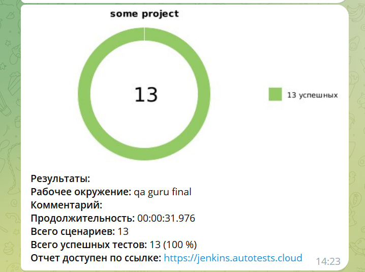

# Проект по автоматизации тестирования для компании [EDNA](https://edna.io/)

> EDNA — лидер в сфере мобильного информирования и текстовых коммуникаций в России, единственная в России IT-компания, которая имеет прямые контракты с Viber, Apple, WhatsApp, VK.
> ## **Содержание:**
____

* <a href="#tools">Технологии и инструменты</a>
* <a href="#cases">Примеры автоматизированных тест-кейсов</a>
* <a href="#jenkins">Сборка в Jenkins</a>
* <a href="#allure">Allure отчет</a>
* <a href="#allure-testops">Интеграция с Allure TestOps</a>
* <a href="#telegram">Уведомление в Telegram при помощи бота</a>
____

## <a name="Технологии и инструменты">**Технологии и инструменты:**</a>

  
  
  
   

   
   

____

## <a name="Примеры автоматизированных тест-кейсов">**Примеры автоматизированных тест-кейсов:**</a>
____
- ✓ *ContactFormEdnaProgramPage - Проверяем основные элементы формы*
- ✓ *ContactFormPage -Проверяем основные элементы формы далее Проверяем основные элементы  на обязательное заполнение полей*
- ✓ *MainPage - Переключаем язык на Индонезийский и проверяем, что язык переключился*
- ✓ *NewsOutput - Проверяем что вывелось больше новостей*
- ✓ *ResourcesPage - Проверяем, что выводятся новые ресурсы'*
- ✓ *SearchPage - Проверка результата положительного теста и произвольный набор символов негативного теста*
- ✓ *Поиск несуществующей строки в разделе 'Компания'*
____

## </a>Сборка в [Jenkins](https://jenkins.autotests.cloud/job/qa_guru_final.D.Y_/)</a>
____

  
  

### **Параметры сборки в Jenkins:**

- *browser (браузер, по умолчанию chrome)*
- *browserVersion (версия браузера, по умолчанию 100.0)*
- *browserSize (размер окна браузера, по умолчанию 1920x1080)*
### *Основная страница отчёта*

  
  

### *Тест-кейсы*

  
  

### *Основная страница отчёта API*

  
  

### *Тест-кейсы API*

  
  

____

## </a>Интеграция с <a target="_blank" href="https://allure.autotests.cloud/project/3468/dashboards">Allure TestOps</a>
____

### *Allure TestOps Dashboard*

  
  

### *Авто тест-кейсы*

  
  

____

## </a> Уведомление в Telegram при помощи бота
____

  
  

